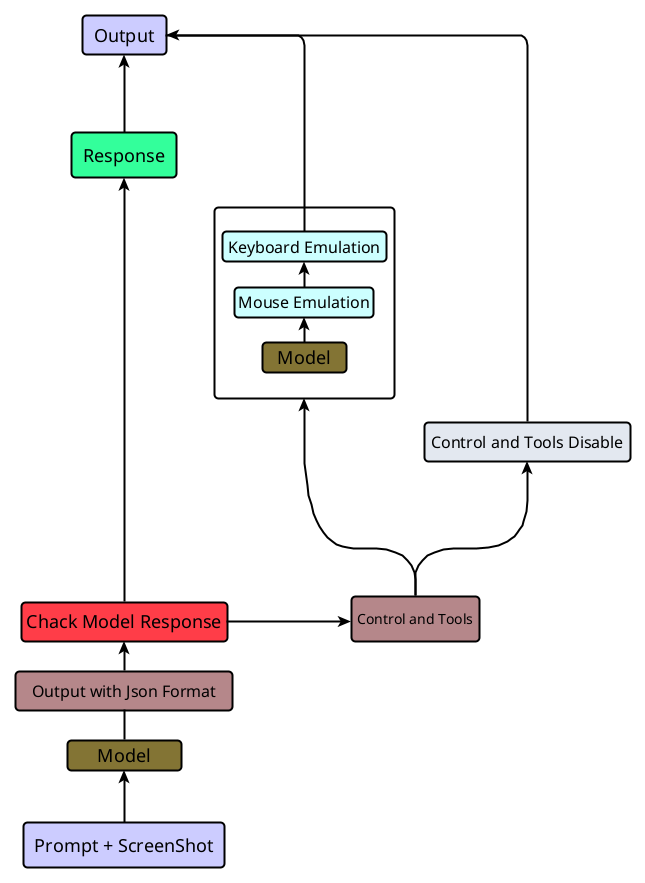

# Viora

Viora is a Research Project that I'm Trying to make a agent to do the tasks without any automation or Intervention.

> **Note:** This project is currently under active development and is not finalized. You should expect bugs, unstable behavior, and breaking changes. Use with caution in any critical environments.

---

## How It Works


<p align="center">
  
</p>

---

## Key Features

* **Full Autonomous Agent:** Trying to make Viora do task it self without any automation,
* **Compter Control:** The agent can Use use the compter-machine using keyboard and mouse by It self,
* **More automonous Features:** Future releases.

---

## Requirements

Before setting up the project, ensure you have the following installed:

* Python 3.14
* Poetry, pip for package management
* Access to OpenAI and Deepgram API Key

---

## Installation

1. Clone the repository:
  ```bash
  git clone [https://github.com/iliakarimi/viora.git](https://github.com/iliakarimi/viora.git)
  cd viora && cd viora
  ```

2. Install dependencies:
  ```bash
  ./install.sh
  ```

or if you want install Viora manually:

```bash
python3.14 -m venv .venv
source .venv/bin/activate
pip install -r "requirements.txt"
```
also you need `scrot` and `gnome-screenshot` on linux with(If not installed):
```bash
# debian & ubuntu:
sudo apt-get install scrot tk-dev python3-tk gnome-screenshot

# fedora:
sudo dnf install scrot gnome-screenshot

# arch linux:
sudo pacman -S scrot gnome-screenshot
```
### Important Note: Wayland Issue (Modern Linux Distributions)

Modern Linux distributions (such as Ubuntu 22.04 and later) use **Wayland** as their default window display server. For security reasons, Wayland restricts Python applications from capturing screenshots of the entire screen. This can cause `pyautogui` to throw an error or save a completely black image.

#### Solution: Switch to Xorg (X11)
To resolve this issue, you need to switch your display server back to Xorg (X11):

1. **Log out** of your current Linux user session to return to the Login Screen.
2. Click on your **username**.
3. Before entering your password, click on the **gear icon** (usually located in the bottom-right corner of the screen).
4. Select **Ubuntu on Xorg**, **GNOME on Xorg**, or any option that contains **Xorg** or **X11**.
5. Enter your password and log in.

Once logged in via Xorg, your `pyautogui` screenshot code will work flawlessly without any issues.

#### How to Install X11 (If missing)

If Xorg/X11 is not available on your system, you can install it using your distribution's package manager:

  ```bash
  # Ubuntu / Debian / Mint:
    sudo apt update
    sudo apt install xorg

  # Fedora:
  sudo dnf groupinstall "X Window System"

  # Arch:
  sudo pacman -S xorg-server xorg-xinit
  ```
#### For KDE Plasma Users

If you are using the KDE Plasma desktop environment:

1. **Log out** of your current session.
2. On the login screen (SDDM), look for the **Desktop Session** dropdown menu (usually located in the bottom-left corner or near the password field).
3. Change the session from **Plasma (Wayland)** to **Plasma (X11)**.
4. Enter your password and log in.

*Note: If the X11 option is missing in your KDE session list, you need to install the KDE X11 workspace package:*

  ```bash
  # Kubuntu / Neon / Debian KDE:
  sudo apt update
  sudo apt install plasma-workspace-x11

  # Fedora KDE Spin:
  sudo dnf install plasma-workspace-x11

  # Arch:
  sudo pacman -S xorg-server
  ```


##### After installation, you will need to restart your system or log out to see the Xorg option on the login screen.

---

## Configuration

Open the `.env` file and populate it with your API credentials:
```env
OPENAI_API_KEY=ENTER-YOUR-OPENAI-API-KEY
DEEPGRAM_API=ENTER-YOUR-DEEPGRAM-API-KEY
```

Then run `configure.py` to enter your information:
```bash
python configure.py
```

---

## Usage

### Quick Start

To launch the agent in interactive CLI mode, run:

```bash
python chat.py
```

---

## Project Roadmap

* [x] Add base Computer-Control
* [ ] Integration with web search and file tools
* [ ] Add Advanced Long-Term and Short-Term memory
* [ ] Add Fine-tuned local open-source LLMs

---

## Contributing

Contributions are welcome to help improve this agent. Please follow these steps to contribute:

1. Fork the repository.
2. Create a new branch (`git checkout -b feature/your-feature-name`).
3. Commit your changes (`git commit -m 'Add some feature'`).
4. Push to the branch (`git push origin feature/your-feature-name`).
5. Open a Pull Request.

Please ensure your code passes all linters and tests before submitting a PR.

---

## License

Distributed under the Apache-2.0 License. See `LICENSE` for more information.

---

## Contact

Ilia Karimi - iliakarimi.dev@gmail.com
